# 📋 เอกสารวิเคราะห์และออกแบบระบบ (Analysis & Design Document)
## ระบบร้านขายรูปภาพศิลปะออนไลน์ — Art Gallery Platform
**จัดทำโดย:** นัธทวัฒน์ ปิ่นปั่น, กษิดิ์เดช เนียมทอง, ณัฐพงศ์ จุลละลุจิ, ธนชล แจงเจริญ, นันธวัช สงนุ้ย

---

## 1. บทนำ (Introduction)

### 1.1 วัตถุประสงค์ของระบบ (System Objectives)
ระบบร้านขายรูปภาพศิลปะออนไลน์ (**Art Gallery Platform**) พัฒนาขึ้นเพื่อเป็นแพลตฟอร์มที่เชื่อมต่อระหว่าง **ศิลปิน (Artists)** ผู้สร้างสรรค์ผลงาน และ **ลูกค้า (Customers)** ผู้สนใจสั่งซื้อผลงานศิลปะทั้งในรูปแบบไฟล์ดิจิทัลและงานพิมพ์คุณภาพสูง (Print on Demand)

### 1.2 ขอบเขตของระบบ (System Scope)
- รองรับการลงทะเบียนและเข้าสู่ระบบ (JWT / OAuth2)
- แสดงและค้นหาผลงานศิลปะตามหมวดหมู่ สไตล์ และศิลปิน
- สั่งซื้อและชำระเงินผ่านระบบออนไลน์ (Stripe / PromptPay)
- ศิลปินอัปโหลดผลงานพร้อมระบบ Watermark อัตโนมัติ
- ระบบจัดการคำสั่งซื้อ การพิมพ์ และจัดส่ง

### 1.3 ผู้ใช้งานระบบ (System Users / Stakeholders)
| ผู้ใช้ | บทบาท | ความต้องการหลัก |
|---|---|---|
| **ลูกค้า (Customer)** | ผู้ซื้อผลงานศิลปะ | ค้นหา เลือกดู สั่งซื้อ และชำระเงิน |
| **ศิลปิน (Artist)** | ผู้สร้างสรรค์ผลงาน | อัปโหลดผลงาน ตั้งราคา จัดการคำสั่งซื้อ |
| **ผู้ดูแลระบบ (Admin)** | ผู้ดูแลแพลตฟอร์ม | จัดการผู้ใช้ ตรวจสอบเนื้อหา ดูรายงาน |

---

## 2. การวิเคราะห์ความต้องการ (Requirements Analysis)

### 2.1 ความต้องการเชิงฟังก์ชัน (Functional Requirements)

#### FR-01: ระบบสมาชิกและการยืนยันตัวตน (Authentication & Authorization)
- ผู้ใช้สามารถสมัครสมาชิกด้วยอีเมลและรหัสผ่าน
- รองรับการเข้าสู่ระบบผ่าน OAuth2 (Google Account)
- ใช้ JWT (JSON Web Token) ในการจัดการ Session
- แบ่งระดับสิทธิ์การเข้าถึง: Customer, Artist, Admin

#### FR-02: ระบบแสดงผลงานศิลปะ (Art Gallery & Browsing)
- แสดงภาพตัวอย่างแบบ Watermark เพื่อปกป้องลิขสิทธิ์
- รองรับการค้นหาด้วยคำสำคัญ หมวดหมู่ แท็ก สีหลัก และช่วงราคา
- ซูมภาพเพื่อดูรายละเอียดของผลงาน
- แสดงข้อมูลศิลปินและผลงานที่เกี่ยวข้อง

#### FR-03: ระบบตะกร้าสินค้าและการสั่งซื้อ (Shopping Cart & Orders)
- เพิ่ม/ลบรายการในตะกร้าสินค้า
- เลือกขนาดพิมพ์ (A4, A3, A2, A1) และประเภทกรอบ (ไม้, อลูมิเนียม)
- คำนวณราคาค่าพิมพ์ กรอบ และค่าจัดส่งอัตโนมัติ
- บันทึกประวัติการสั่งซื้อและสถานะจัดส่ง

#### FR-04: ระบบชำระเงิน (Payment Gateway)
- รองรับการชำระเงินผ่าน Stripe (บัตรเครดิต/เดบิต)
- รองรับการชำระเงินผ่าน PromptPay (QR Code)
- แจ้งเตือนผลการชำระเงินผ่านอีเมลอัตโนมัติ

#### FR-05: ระบบจัดการสำหรับศิลปิน (Artist Dashboard)
- อัปโหลดไฟล์ภาพความละเอียดสูง (High-resolution)
- ระบบสร้าง Watermark อัตโนมัติก่อนเผยแพร่ตัวอย่าง
- ตั้งราคาขายไฟล์ดิจิทัลและราคาเริ่มต้นงานพิมพ์
- แดชบอร์ดแสดงสถิติยอดขายและจำนวนการเข้าชม

#### FR-06: ระบบรายการโปรด (Wishlist)
- บันทึกผลงานที่สนใจลงรายการโปรดส่วนตัว
- แจ้งเตือนเมื่อมีโปรโมชันหรือราคาพิเศษ

---

### 2.2 ความต้องการที่ไม่ใช่เชิงฟังก์ชัน (Non-Functional Requirements)

| รหัส | หมวด | รายละเอียด |
|---|---|---|
| **NFR-01** | ความปลอดภัย (Security) | ใช้ HTTPS, JWT Token, Rate Limiting, Pre-signed URLs สำหรับไฟล์ S3 |
| **NFR-02** | ประสิทธิภาพ (Performance) | โหลดหน้าแรกภายใน 2 วินาที, ใช้ Redis Cache ลด Database Load |
| **NFR-03** | ความพร้อมใช้งาน (Availability) | Uptime ≥ 99.5%, ใช้ Docker + AWS สำหรับ Deployment |
| **NFR-04** | ความสามารถในการขยาย (Scalability) | รองรับผู้ใช้พร้อมกัน ≥ 1,000 คน |
| **NFR-05** | การตอบสนอง (Responsiveness) | รองรับการแสดงผลบน Desktop, Tablet, Mobile (Mobile-first) |
| **NFR-06** | ความเป็นส่วนตัว (Privacy) | เก็บรหัสผ่านแบบ Hash (bcrypt), ปฏิบัติตาม PDPA |

---

## 3. Use Case Diagram

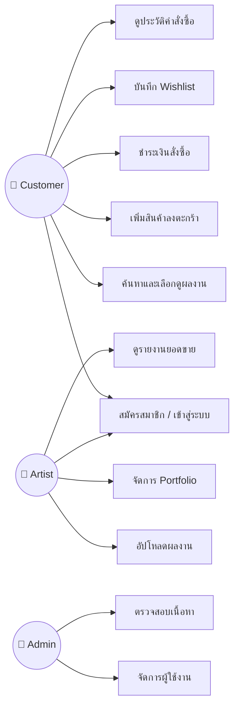

---

## 4. User Flow Diagram

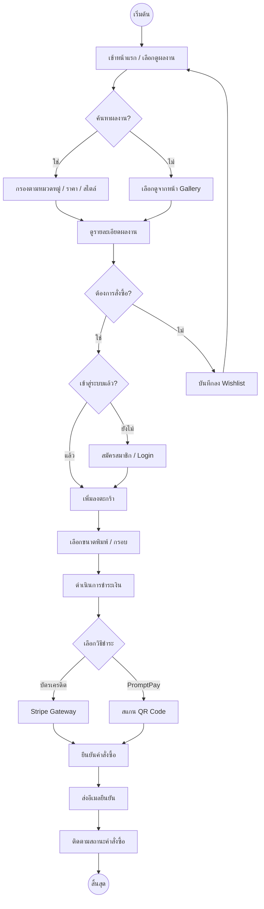

---

## 5. Entity Relationship Diagram (ERD)

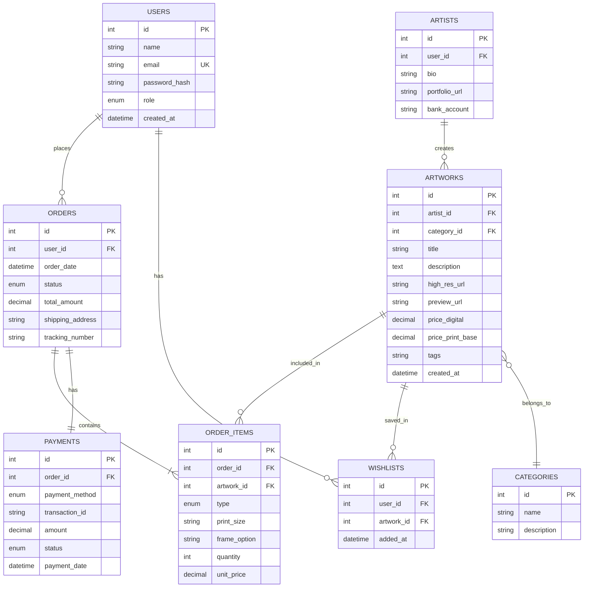

---

## 6. Sequence Diagram: กระบวนการสั่งซื้อผลงาน

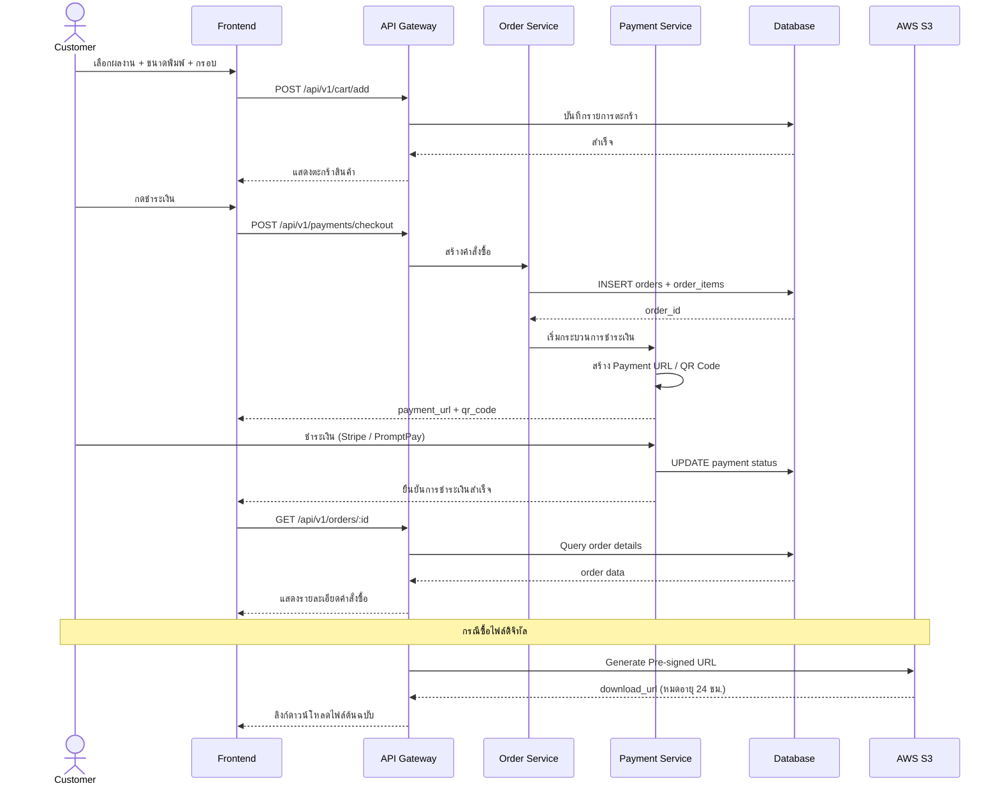

---

## 7. System Architecture Diagram

ดูรายละเอียดไดอะแกรมสถาปัตยกรรมระบบฉบับเต็มได้ที่ไฟล์ [architecture.mmd](architecture.mmd)

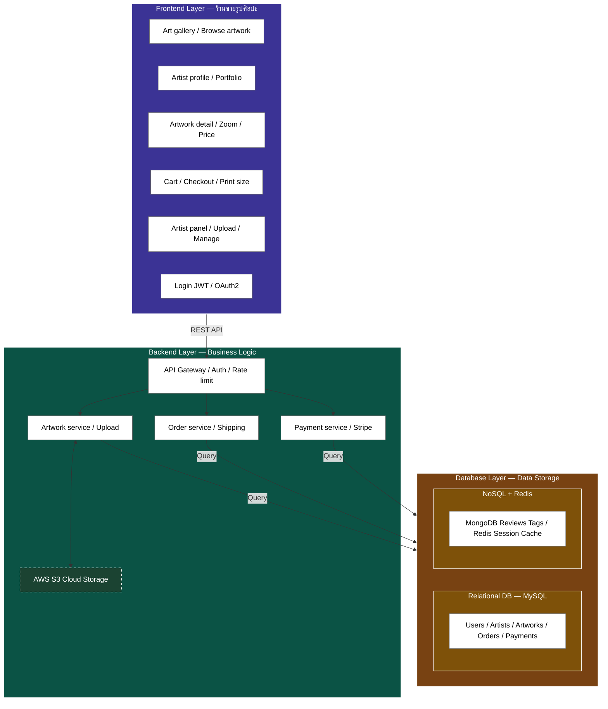

---

## 8. Database Schema Detail

### 8.1 ตาราง `users`
| Field | Type | Constraint | Description |
|---|---|---|---|
| `id` | INT | PK, AUTO_INCREMENT | รหัสผู้ใช้ |
| `name` | VARCHAR(100) | NOT NULL | ชื่อ-นามสกุล |
| `email` | VARCHAR(100) | UNIQUE, NOT NULL | อีเมล (สำหรับ Login) |
| `password_hash` | VARCHAR(255) | NOT NULL | รหัสผ่านที่แฮชด้วย bcrypt |
| `role` | ENUM('customer','artist','admin') | DEFAULT 'customer' | บทบาทผู้ใช้ |
| `created_at` | TIMESTAMP | DEFAULT CURRENT_TIMESTAMP | วันที่สร้างบัญชี |

### 8.2 ตาราง `artists`
| Field | Type | Constraint | Description |
|---|---|---|---|
| `id` | INT | PK, AUTO_INCREMENT | รหัสศิลปิน |
| `user_id` | INT | FK → users.id | อ้างอิงผู้ใช้ |
| `bio` | TEXT | | ประวัติศิลปิน |
| `portfolio_url` | VARCHAR(300) | | ลิงก์ Portfolio |
| `bank_account` | VARCHAR(50) | | เลขบัญชีรับเงิน |

### 8.3 ตาราง `artworks`
| Field | Type | Constraint | Description |
|---|---|---|---|
| `id` | INT | PK, AUTO_INCREMENT | รหัสผลงาน |
| `artist_id` | INT | FK → artists.id | ศิลปินเจ้าของผลงาน |
| `category_id` | INT | FK → categories.id | หมวดหมู่ |
| `title` | VARCHAR(200) | NOT NULL | ชื่อผลงาน |
| `description` | TEXT | | คำอธิบายผลงาน |
| `high_res_url` | VARCHAR(500) | NOT NULL | URL ไฟล์ต้นฉบับ (S3 Private) |
| `preview_url` | VARCHAR(500) | NOT NULL | URL ตัวอย่าง Watermark (S3 Public) |
| `price_digital` | DECIMAL(10,2) | NOT NULL | ราคาไฟล์ดิจิทัล (บาท) |
| `price_print_base` | DECIMAL(10,2) | | ราคาเริ่มต้นงานพิมพ์ (บาท) |
| `tags` | VARCHAR(500) | | แท็กคั่นด้วย comma |
| `created_at` | TIMESTAMP | DEFAULT CURRENT_TIMESTAMP | วันที่อัปโหลด |

### 8.4 ตาราง `orders`
| Field | Type | Constraint | Description |
|---|---|---|---|
| `id` | INT | PK, AUTO_INCREMENT | รหัสคำสั่งซื้อ |
| `user_id` | INT | FK → users.id | ผู้สั่งซื้อ |
| `order_date` | DATETIME | NOT NULL | วันที่สั่ง |
| `status` | ENUM('pending','paid','printing','shipped','completed','cancelled') | DEFAULT 'pending' | สถานะ |
| `total_amount` | DECIMAL(10,2) | NOT NULL | ยอดรวม |
| `shipping_address` | TEXT | | ที่อยู่จัดส่ง |
| `tracking_number` | VARCHAR(100) | | เลขพัสดุ |

### 8.5 ตาราง `order_items`
| Field | Type | Constraint | Description |
|---|---|---|---|
| `id` | INT | PK, AUTO_INCREMENT | รหัสรายการ |
| `order_id` | INT | FK → orders.id | คำสั่งซื้อ |
| `artwork_id` | INT | FK → artworks.id | ผลงาน |
| `type` | ENUM('digital','print') | NOT NULL | ประเภทสินค้า |
| `print_size` | VARCHAR(10) | | ขนาดพิมพ์ (A4, A3, A2, A1) |
| `frame_option` | VARCHAR(50) | | ตัวเลือกกรอบ |
| `quantity` | INT | DEFAULT 1 | จำนวน |
| `unit_price` | DECIMAL(10,2) | NOT NULL | ราคาต่อหน่วย |

### 8.6 ตาราง `payments`
| Field | Type | Constraint | Description |
|---|---|---|---|
| `id` | INT | PK, AUTO_INCREMENT | รหัสการชำระเงิน |
| `order_id` | INT | FK → orders.id | คำสั่งซื้อ |
| `payment_method` | ENUM('credit_card','promptpay') | NOT NULL | วิธีชำระเงิน |
| `transaction_id` | VARCHAR(200) | | รหัสธุรกรรม |
| `amount` | DECIMAL(10,2) | NOT NULL | จำนวนเงิน |
| `status` | ENUM('pending','success','failed','refunded') | DEFAULT 'pending' | สถานะ |
| `payment_date` | DATETIME | | วันที่ชำระ |

---

## 9. API Endpoints Summary

### 9.1 Authentication
| Method | Endpoint | Description |
|---|---|---|
| POST | `/api/v1/auth/register` | สมัครสมาชิกใหม่ |
| POST | `/api/v1/auth/login` | เข้าสู่ระบบ (รับ JWT Token) |
| POST | `/api/v1/auth/google` | เข้าสู่ระบบผ่าน Google OAuth2 |
| POST | `/api/v1/auth/refresh` | ต่ออายุ Token |

### 9.2 Artworks
| Method | Endpoint | Description |
|---|---|---|
| GET | `/api/v1/artworks` | ดึงรายการผลงานทั้งหมด (พร้อม filter/search) |
| GET | `/api/v1/artworks/:id` | ดึงรายละเอียดผลงาน |
| POST | `/api/v1/artworks` | อัปโหลดผลงานใหม่ (Artist only) |
| PUT | `/api/v1/artworks/:id` | แก้ไขข้อมูลผลงาน (Artist only) |
| DELETE | `/api/v1/artworks/:id` | ลบผลงาน (Artist/Admin only) |

### 9.3 Orders & Payments
| Method | Endpoint | Description |
|---|---|---|
| GET | `/api/v1/orders` | ดูรายการคำสั่งซื้อของตัวเอง |
| GET | `/api/v1/orders/:id` | ดูรายละเอียดคำสั่งซื้อ |
| POST | `/api/v1/cart/add` | เพิ่มสินค้าลงตะกร้า |
| POST | `/api/v1/payments/checkout` | เริ่มชำระเงิน |
| POST | `/api/v1/payments/webhook` | รับการแจ้งเตือนจาก Payment Gateway |

### 9.4 Wishlist
| Method | Endpoint | Description |
|---|---|---|
| GET | `/api/v1/wishlist` | ดูรายการโปรด |
| POST | `/api/v1/wishlist` | เพิ่มผลงานลงรายการโปรด |
| DELETE | `/api/v1/wishlist/:artwork_id` | ลบออกจากรายการโปรด |

---

## 10. เทคโนโลยีที่ใช้ (Technology Stack)

| Layer | เทคโนโลยี | เหตุผล |
|---|---|---|
| **Frontend** | React / Next.js (SSR) | SEO ดี, โหลดเร็ว, Mobile-first |
| **Backend** | Node.js / Express.js | Non-blocking I/O, npm ecosystem ใหญ่ |
| **Database (SQL)** | MySQL 8 | ACID Transactions, ข้อมูลธุรกรรมมั่นคง |
| **Database (NoSQL)** | MongoDB | Schema ยืดหยุ่น สำหรับ reviews/tags |
| **Cache** | Redis | Session management, ลด DB load |
| **Storage** | AWS S3 | เก็บไฟล์ภาพ High-res + Watermark |
| **Payment** | Stripe + PromptPay API | รองรับบัตรเครดิตและ QR Payment |
| **Auth** | JWT + OAuth2 (Google) | ปลอดภัย, Stateless |
| **DevOps** | Docker + GitHub Actions | CI/CD Pipeline อัตโนมัติ |
| **Hosting** | AWS EC2 / Elastic Beanstalk | ขยายขนาดได้ง่าย |

---

## 11. Software Architecture (สถาปัตยกรรมซอฟต์แวร์)

สำหรับธุรกิจ SMEs ที่มีทั้งระบบขายสินค้าออนไลน์ ระบบสมาชิก การชำระเงิน และการเชื่อมต่อคลังสินค้า สามารถวิเคราะห์ **Software Architecture** ตามองค์ประกอบหลัก 3 ชั้น ได้ดังนี้:

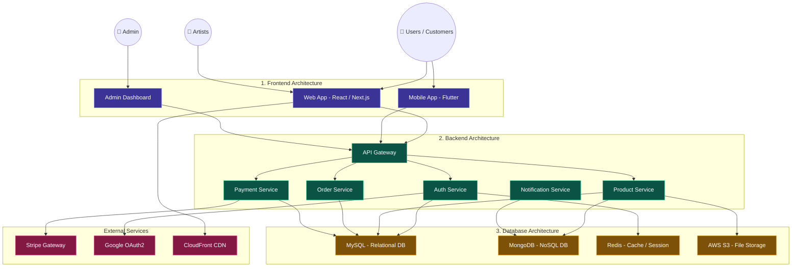

---

### 11.1 Frontend Architecture (ส่วนที่ผู้ใช้งานโต้ตอบกับระบบ)

#### หน้าที่หลักของ Frontend
| หน้าที่ | รายละเอียด |
|---|---|
| แสดงหน้าเว็บไซต์ / Mobile App | หน้า Landing Page, Gallery, รายละเอียดสินค้า |
| ระบบสมัครสมาชิก / Login | ฟอร์มสมัครสมาชิก, Login ด้วยอีเมลหรือ Google |
| แสดงสินค้า | Gallery ผลงานศิลปะ, ค้นหา, กรองตามหมวดหมู่/ราคา/สไตล์ |
| ตะกร้าสินค้า (Cart) | เพิ่ม/ลบรายการ, เลือกขนาดพิมพ์, เลือกกรอบ |
| ระบบชำระเงิน | Stripe (บัตรเครดิต), PromptPay (QR Code) |
| Dashboard ผู้ดูแลระบบ | จัดการผู้ใช้, ตรวจสอบเนื้อหา, ดูรายงานยอดขาย |

#### โครงสร้างสถาปัตยกรรม Frontend

**Component-Based Architecture / Single Page Application (SPA)**

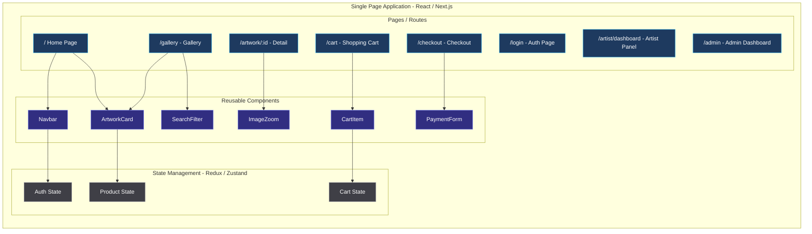

#### เทคโนโลยีที่เหมาะสม

| ประเภท | เทคโนโลยี | เหตุผล |
|---|---|---|
| **Web Frontend** | React / Next.js | Component-based, SSR สำหรับ SEO, Ecosystem ใหญ่ |
| **Mobile Frontend** | Flutter / React Native | Cross-platform (iOS + Android) จาก Codebase เดียว |
| **State Management** | Redux Toolkit / Zustand | จัดการ State ระดับ Global (Cart, Auth, Product) |
| **UI Framework** | Material UI / Chakra UI | Component สำเร็จรูป, Responsive, Accessible |

#### สิ่งที่ควรพิจารณา

| หมวด | รายละเอียด |
|---|---|
| **UX/UI** | Responsive Design, Mobile First, User Experience ที่ลื่นไหล |
| **Security** | JWT Authentication สำหรับ API calls, OAuth2 / SSO ผ่าน Google |
| **Scalability** | ใช้ CDN (CloudFront) สำหรับ Static Assets, Browser Caching, Lazy Loading สำหรับรูปภาพ |
| **Performance** | Code Splitting, Image Optimization (WebP), Virtual Scrolling สำหรับ Gallery ขนาดใหญ่ |

---

### 11.2 Backend Architecture (ส่วนประมวลผลหลักของระบบ)

#### หน้าที่หลักของ Backend
| หน้าที่ | รายละเอียด |
|---|---|
| จัดการ Business Logic | ประมวลผลคำสั่งซื้อ, คำนวณราคา, จัดการ workflow |
| ระบบสมาชิก | สมัคร, Login, จัดการ Profile, Role-based Access |
| ระบบคำสั่งซื้อ | สร้าง Order, อัปเดตสถานะ, ติดตามการจัดส่ง |
| ระบบชำระเงิน | เชื่อมต่อ Payment Gateway, จัดการ Webhook |
| ระบบจัดการสินค้า | CRUD ผลงานศิลปะ, อัปโหลดภาพ, สร้าง Watermark |
| เชื่อมต่อ API ภายนอก | Stripe, Google OAuth, AWS S3, Email Service |

#### โครงสร้างสถาปัตยกรรม Backend

**ระยะเริ่มต้น: Monolithic Architecture** (เหมาะกับทีมเล็ก พัฒนาเร็ว)

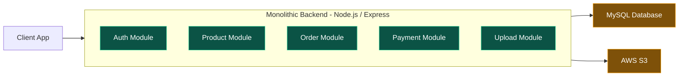

**ระยะขยายระบบ: Microservices Architecture** (แยกบริการเป็นอิสระต่อการให้บริการ)

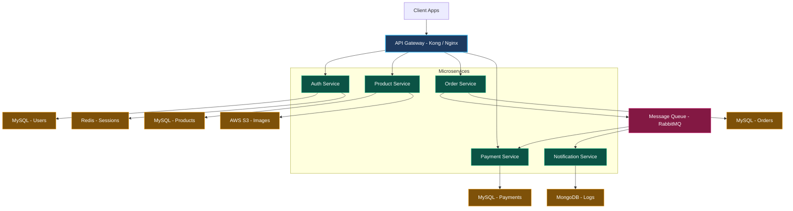

#### เทคโนโลยีที่เหมาะสม

| ประเภท | เทคโนโลยี | เหตุผล |
|---|---|---|
| **Backend Framework** | Node.js / Express.js | Non-blocking I/O, npm ecosystem ขนาดใหญ่, JavaScript ตลอด Stack |
| **Alternative** | Django (Python) / Spring Boot (Java) | เหมาะกับทีมที่ถนัด Python หรือ Java |
| **API Architecture** | REST API / GraphQL | REST เรียบง่าย, GraphQL ยืดหยุ่นสำหรับ query ซับซ้อน |
| **API Gateway** | Kong / Nginx / AWS API Gateway | Authentication, Routing, Rate Limiting, Load Balancing |
| **Message Queue** | RabbitMQ / Apache Kafka | สำหรับ Async Processing (ส่งอีเมล, ประมวลผลภาพ) |

#### DevOps / Infrastructure

| ประเภท | เทคโนโลยี | เหตุผล |
|---|---|---|
| **Container** | Docker + Docker Compose | แยก Environment, Deploy สะดวก, Reproducible |
| **CI/CD** | GitHub Actions | Automated Testing, Build, Deploy Pipeline |
| **Cloud** | Amazon Web Services (AWS) | EC2 / ECS สำหรับ Compute, S3 สำหรับ Storage, RDS สำหรับ Database |
| **Monitoring** | Prometheus + Grafana | ติดตาม Performance, Alert เมื่อระบบมีปัญหา |
| **Logging** | ELK Stack (Elasticsearch, Logstash, Kibana) | รวมศูนย์ Log จากทุก Service, ค้นหาง่าย |

#### แผนภาพ CI/CD Pipeline


---

### 11.3 Database Architecture (ระบบจัดเก็บข้อมูล)

#### หน้าที่หลักของ Database
| หน้าที่ | รายละเอียด |
|---|---|
| เก็บข้อมูลผู้ใช้ | Profile, Credentials, Role, Address |
| เก็บสินค้า | ข้อมูลผลงานศิลปะ, ราคา, หมวดหมู่, Tags |
| คำสั่งซื้อ | Order, Order Items, สถานะ, ที่อยู่จัดส่ง |
| รายการชำระเงิน | Transaction, Payment Method, Status |
| ประวัติการทำงาน | Activity Log, Audit Trail, Session |

#### โครงสร้าง Database ตามรูปแบบฐานข้อมูล

**Relational Database (SQL)** — เหมาะกับข้อมูลธุรกรรม ระบบสั่งซื้อ ความถูกต้องของข้อมูลสูง

| ฐานข้อมูล | ใช้เก็บข้อมูล | จุดเด่น |
|---|---|---|
| **MySQL** | Users, Artists, Artworks, Orders, Payments, Categories | ACID Compliance, เหมาะกับข้อมูลธุรกรรม |
| **PostgreSQL** | ทางเลือก — รองรับ JSON, Full-text Search | Advanced features, Extensible |
| **Microsoft SQL Server** | ทางเลือกองค์กรขนาดใหญ่ | Enterprise-grade, BI Integration |

**NoSQL Database** — เหมาะกับข้อมูล Log, Session, Big Data, Recommendation

| ฐานข้อมูล | ใช้เก็บข้อมูล | จุดเด่น |
|---|---|---|
| **MongoDB** | Reviews, Tags, Search Index, Activity Logs | Schema ยืดหยุ่น, Document-based |
| **Redis** | Session, Cache, Cart (ชั่วคราว), Rate Limiting | In-memory, เร็วมาก, TTL support |

#### แผนภาพ Database Architecture

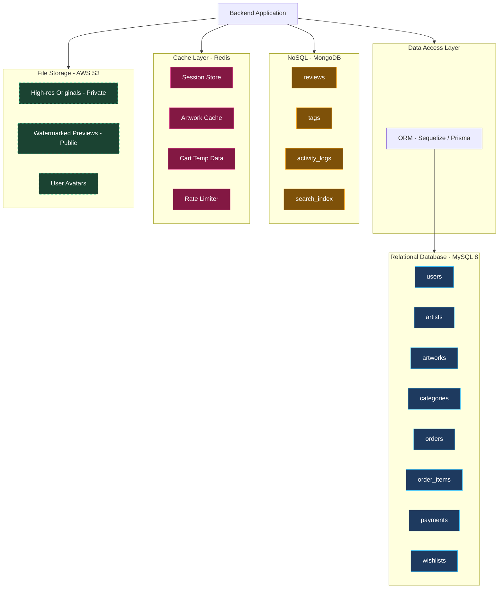

#### Database Design Principles

| หลักการ | รายละเอียด |
|---|---|
| **Normalization** | ออกแบบตาราง SQL ให้อยู่ในรูปแบบ 3NF (Third Normal Form) เพื่อลดความซ้ำซ้อนของข้อมูล |
| **Indexing** | สร้าง Index บนคอลัมน์ที่ใช้ค้นหาบ่อย เช่น `email`, `artwork_id`, `order_date` |
| **Foreign Keys** | กำหนด FK Constraints เพื่อรักษา Referential Integrity ระหว่างตาราง |
| **Backup & Recovery** | Automated Daily Backup, Point-in-Time Recovery, Cross-region Replication |
| **Partitioning** | แบ่ง Partition ตาราง `orders` และ `payments` ตามเดือน เมื่อข้อมูลมีขนาดใหญ่ |
| **Read Replica** | ใช้ Read Replica สำหรับ Query ที่ไม่ต้องการ Real-time เพื่อลด Load บน Primary DB |

#### ตัวอย่าง SQL Schema

```sql
-- สร้างตาราง users
CREATE TABLE users (
    id INT PRIMARY KEY AUTO_INCREMENT,
    name VARCHAR(100) NOT NULL,
    email VARCHAR(100) UNIQUE NOT NULL,
    password_hash VARCHAR(255) NOT NULL,
    role ENUM('customer', 'artist', 'admin') DEFAULT 'customer',
    created_at TIMESTAMP DEFAULT CURRENT_TIMESTAMP,
    INDEX idx_email (email),
    INDEX idx_role (role)
) ENGINE=InnoDB DEFAULT CHARSET=utf8mb4;

-- สร้างตาราง artworks
CREATE TABLE artworks (
    id INT PRIMARY KEY AUTO_INCREMENT,
    artist_id INT NOT NULL,
    category_id INT NOT NULL,
    title VARCHAR(200) NOT NULL,
    description TEXT,
    high_res_url VARCHAR(500) NOT NULL,
    preview_url VARCHAR(500) NOT NULL,
    price_digital DECIMAL(10,2) NOT NULL,
    price_print_base DECIMAL(10,2),
    tags VARCHAR(500),
    created_at TIMESTAMP DEFAULT CURRENT_TIMESTAMP,
    FOREIGN KEY (artist_id) REFERENCES artists(id) ON DELETE CASCADE,
    FOREIGN KEY (category_id) REFERENCES categories(id),
    INDEX idx_artist (artist_id),
    INDEX idx_category (category_id),
    FULLTEXT INDEX idx_search (title, description, tags)
) ENGINE=InnoDB DEFAULT CHARSET=utf8mb4;

-- สร้างตาราง orders
CREATE TABLE orders (
    id INT PRIMARY KEY AUTO_INCREMENT,
    user_id INT NOT NULL,
    order_date DATETIME NOT NULL DEFAULT CURRENT_TIMESTAMP,
    status ENUM('pending','paid','printing','shipped','completed','cancelled') DEFAULT 'pending',
    total_amount DECIMAL(10,2) NOT NULL,
    shipping_address TEXT,
    tracking_number VARCHAR(100),
    FOREIGN KEY (user_id) REFERENCES users(id),
    INDEX idx_user (user_id),
    INDEX idx_status (status),
    INDEX idx_date (order_date)
) ENGINE=InnoDB DEFAULT CHARSET=utf8mb4;
```

---

### 11.4 สรุปภาพรวม Software Architecture

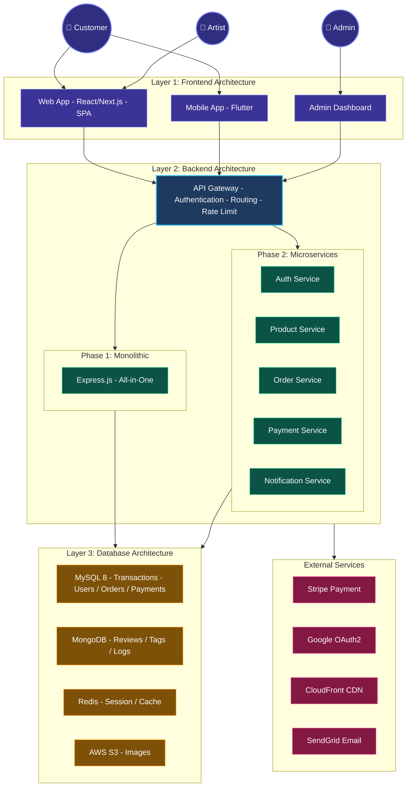

| Layer | สถาปัตยกรรม | เทคโนโลยีหลัก | หน้าที่ |
|---|---|---|---|
| **Frontend** | Component-Based / SPA | React, Next.js, Flutter | แสดง UI, จัดการ State, เรียก API |
| **Backend** | Monolithic → Microservices | Node.js, Express, Docker | Business Logic, API, Authentication |
| **Database** | SQL + NoSQL + Cache | MySQL, MongoDB, Redis | จัดเก็บข้อมูล, Session, Caching |
| **Infrastructure** | Cloud-native | AWS, Docker, GitHub Actions | CI/CD, Hosting, Storage, CDN |

