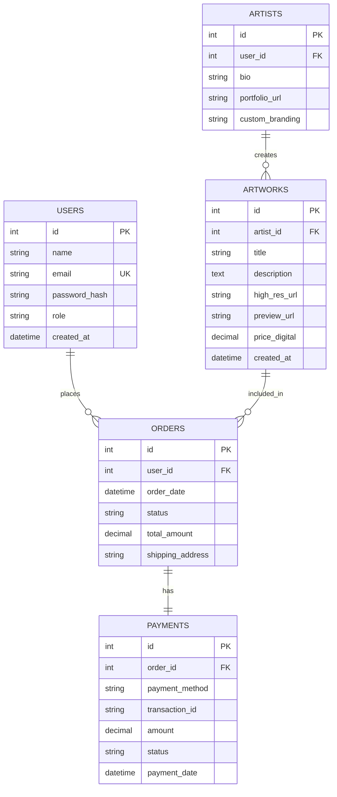
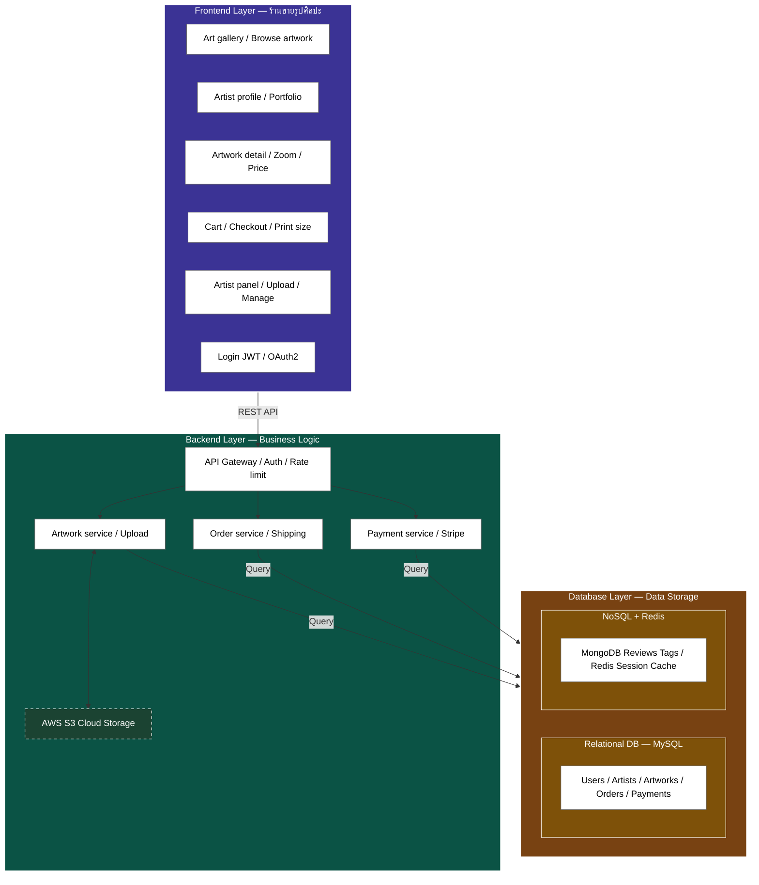

# เอกสารข้อกำหนดความต้องการทางซอฟต์แวร์ (Software Requirements Specification - SRS)
## โปรเจกต์: ระบบร้านขายรูปภาพศิลปะออนไลน์ (Art Gallery Platform)
### ผู้จัดทำ: กษิดิ์เดช เนียมทอง

---

## 1. ภาพรวมระบบ (System Overview)
ระบบร้านขายรูปภาพศิลปะออนไลน์ (Art Gallery Platform) เป็นแพลตฟอร์มที่เชื่อมต่อระหว่าง **ศิลปิน (Artists)** ผู้สร้างสรรค์ผลงาน และ **ลูกค้า (Customers)** ผู้ต้องการสั่งซื้อรูปภาพในรูปแบบดิจิทัลและการพิมพ์ (Print on Demand)

ระบบนี้รองรับการแสดงผลงานแบบ Mobile-First โดยทำงานอยู่บนระบบ Frontend ด้วย React / Next.js ที่ทำ Server-Side Rendering (SSR) และมี Backend เป็น Node.js/Express สำหรับจัดการส่วนของ Business Logic พร้อมทั้งใช้ AWS S3 สำหรับจัดเก็บไฟล์ต้นฉบับคุณภาพสูง (High-Resolution) และจัดทำไฟล์ลายน้ำ (Watermarked Previews) เพื่อป้องกันการละเมิดลิขสิทธิ์

---

## 2. ความต้องการทางระบบ (System Requirements)

### 2.1 ความต้องการเชิงฟังก์ชัน (Functional Requirements)

#### ก. ฝั่งลูกค้า (Customer Portal)
- **การเลือกดูผลงาน (Browse Artwork):** ค้นหาและคัดกรองรูปภาพตามหมวดหมู่ ชื่อศิลปิน สไตล์ แท็ก สีหลัก หรือช่วงราคา
- **โปรไฟล์ศิลปิน (Artist Profile):** เข้าดูผลงานทั้งหมด ประวัติ (Bio) และช่องทางการติดต่อของศิลปิน
- **รายละเอียดผลงาน (Artwork Detail):** ดูรายละเอียดรูปภาพ ซูมภาพตัวอย่าง (Watermarked) เลือกขนาดพิมพ์ (Print Size) และประเภทกรอบรูป (Framing Option)
- **ตะกร้าสินค้าและการชำระเงิน (Cart & Checkout):** บันทึกรายการที่ต้องการซื้อ คำนวณราคาค่าพิมพ์ กรอบรูป และค่าจัดส่ง
- **การจัดการสมาชิก (Auth):** สมัครสมาชิก เข้าสู่ระบบด้วย JWT หรือ OAuth2 (Google) รวมถึงบันทึกรายการโปรด (Wishlist) และดูประวัติการสั่งซื้อ (Order History)

#### ข. ฝั่งศิลปินและผู้ดูแลระบบ (Artist / Admin Dashboard)
- **การอัปโหลดผลงาน (Upload Artwork):** ศิลปินสามารถอัปโหลดไฟล์ภาพความละเอียดสูง (High-res) โดยระบบจะส่งไปประมวลผลเพิ่มลายน้ำโดยอัตโนมัติบน AWS S3
- **การจัดการผลงาน (Manage Portfolio):** แก้ไขข้อมูลภาพ ตั้งราคาขายดิจิทัลและราคาเริ่มต้นงานพิมพ์
- **การจัดการคำสั่งซื้อ (Order Fulfillment):** ติดตามสถานะการพิมพ์ การเข้ากรอบรูป และการจัดส่งสินค้าให้กับลูกค้า
- **รายงานสรุปยอดขาย (Sales Dashboard):** สรุปรายได้ สถิติยอดขายผลงานแต่ละชิ้น และจำนวนยอดเข้าชม

---

### 2.2 ความต้องการที่ไม่ได้ทำเชิงฟังก์ชัน (Non-Functional Requirements)
- **ความปลอดภัย (Security):**
  - ใช้ HTTPS ตลอดทั้งระบบ
  - จัดการสิทธิ์การใช้งาน API ด้วย JWT (JSON Web Token) และควบคุม Rate Limiting เพื่อป้องกันการโจมตีแบบ DDoS
  - ปกป้องรูปภาพลิขสิทธิ์ต้นฉบับบน AWS S3 ด้วย Pre-signed URLs ที่หมดอายุได้ และเผยแพร่เฉพาะรูปภาพที่มีลายน้ำ (Watermark) ต่อสาธารณะ
- **ความสามารถในการปรับขยาย (Scalability):**
  - จัดเก็บ Session และแคชผลงานยอดนิยมด้วย Redis เพื่อลด Load การทำงานของ MySQL Database
  - ใช้ NoSQL (MongoDB) สำหรับเก็บข้อมูลการรีวิว (Reviews) และแท็ก (Tags) ที่มีโครงสร้างยืดหยุ่นและต้องการความรวดเร็วในการค้นหา
- **ความน่าเชื่อถือและความพร้อมใช้งาน (Reliability & Availability):**
  - ระบบทำ Containerization ด้วย Docker เพื่อให้ย้ายและขยายขนาดของแอปพลิเคชันได้ง่าย
  - ติดตั้งผ่าน GitHub Actions และรันในสภาพแวดล้อมระบบคลาวด์ (AWS EC2 / Elastic Beanstalk)

---

## 3. การออกแบบระบบฐานข้อมูล (Database Design)



### 3.1 Relational Database Schema (MySQL)
ฐานข้อมูลหลักเก็บข้อมูลที่มีความสัมพันธ์กันสูงและต้องการความถูกต้องของธุรกรรม (ACID Transactions) เช่น ข้อมูลผู้ใช้, ข้อมูลทางการเงิน และยอดการสั่งซื้อ

#### ตาราง `users`
| Field | Type | Attributes | Description |
|---|---|---|---|
| `id` | INT | PRIMARY KEY, AUTO_INCREMENT | รหัสผู้ใช้งาน |
| `name` | VARCHAR(100) | NOT NULL | ชื่อ-นามสกุล |
| `email` | VARCHAR(100) | UNIQUE, NOT NULL | อีเมล (ใช้สำหรับ Login) |
| `password_hash` | VARCHAR(255) | NOT NULL | รหัสผ่านที่แฮชแล้ว |
| `role` | ENUM('customer', 'artist', 'admin') | DEFAULT 'customer' | บทบาทของผู้ใช้ |
| `created_at` | TIMESTAMP | DEFAULT CURRENT_TIMESTAMP | วันที่สร้างบัญชี |

#### ตาราง `artworks`
| Field | Type | Attributes | Description |
|---|---|---|---|
| `id` | INT | PRIMARY KEY, AUTO_INCREMENT | รหัสผลงานศิลปะ |
| `artist_id` | INT | FOREIGN KEY (references `artists.id`) | รหัสศิลปินผู้สร้างสรรค์ |
| `title` | VARCHAR(200) | NOT NULL | ชื่อของผลงาน |
| `description` | TEXT | | รายละเอียดคำอธิบายภาพ |
| `high_res_url` | VARCHAR(500) | NOT NULL | ลิงก์ไฟล์ต้นฉบับบน AWS S3 (Private) |
| `preview_url` | VARCHAR(500) | NOT NULL | ลิงก์ไฟล์ตัวอย่างที่มีลายน้ำ (Public) |
| `price_digital` | DECIMAL(10, 2) | NOT NULL | ราคาสำหรับดาวน์โหลดไฟล์ดิจิทัล |
| `created_at` | TIMESTAMP | DEFAULT CURRENT_TIMESTAMP | วันที่อัปโหลดรูปภาพ |

---

### 3.2 NoSQL Database (MongoDB)
เก็บข้อมูลส่วนที่ไม่เป็นโครงสร้างคงที่ เช่น การรีวิวผลงาน (Reviews) และแท็ก (Tags) เพื่อการสืบค้นที่รวดเร็ว

#### Collection `reviews`
```json
{
  "_id": "ObjectId('60d5ec49f3e9641774b2f211')",
  "artwork_id": 105,
  "user": {
    "user_id": 42,
    "name": "Somchai Jaidee"
  },
  "rating": 5,
  "comment": "พิมพ์ลงบนผ้าใบแคนวาสออกมาได้สวยงามและคมชัดมากครับ คุ้มค่าราคามาก",
  "created_at": "2026-06-26T15:30:00Z"
}
```

---

### 3.3 Cache Store (Redis)
ใช้เก็บข้อมูลประเภท Session และเก็บ Cache ผลงานยอดนิยมชั่วคราวเพื่อเร่งความเร็วในการโหลดหน้าเว็บหลัก

- **Key:** `session:<user_id>`
  - **Type:** String (JSON)
  - **Value:** ข้อมูลเซสชันการเข้าสู่ระบบและโทเค็นของระบบ
- **Key:** `artwork:detail:<artwork_id>`
  - **Type:** String (JSON)
  - **Value:** แคชรายละเอียดผลงานเพื่อลดการคิวรี่ MySQL ซ้ำๆ

---

## 4. ข้อกำหนด API (API Specifications)

### 4.1 สมาชิก - สมัครสมาชิกใหม่ (User Registration)
ลงทะเบียนผู้ใช้งานระบบคนใหม่เข้าสู่ระบบ

- **Endpoint:** `POST /api/v1/auth/register`
- **Request Body (JSON):**
```json
{
  "name": "Nattapong Dev",
  "email": "nattapong@example.com",
  "password": "SecurePassword123",
  "role": "customer"
}
```
- **Response Success (201 Created):**
```json
{
  "status": "success",
  "message": "User registered successfully",
  "data": {
    "user_id": 75,
    "name": "Nattapong Dev",
    "email": "nattapong@example.com",
    "role": "customer",
    "created_at": "2026-06-26T16:04:00Z"
  }
}
```

### 4.2 ผลงาน - ดึงรายละเอียดผลงานศิลปะ (Get Artwork Details)
ดึงรายละเอียดของรูปภาพศิลปะพร้อมข้อมูลศิลปินผู้สร้าง

- **Endpoint:** `GET /api/v1/artworks/:id`
- **Response Success (200 OK):**
```json
{
  "status": "success",
  "data": {
    "id": 105,
    "title": "สุนทรียภาพแห่งขุนเขา",
    "description": "ภาพวาดสีน้ำมันทิวทัศน์เทือกเขาที่สะท้อนแสงอาทิตย์ยามเย็น",
    "preview_url": "https://s3.ap-southeast-1.amazonaws.com/art-gallery/previews/mountain-watermark.jpg",
    "price_digital": 1200.00,
    "artist": {
      "artist_id": 8,
      "name": "Chalermchai M.",
      "portfolio_url": "https://artgallery.com/artists/chalermchai"
    },
    "tags": ["painting", "nature", "oil-color"]
  }
}
```

### 4.3 ชำระเงิน - สร้างรายการสั่งซื้อและการชำระเงิน (Create Order & Checkout)
ส่งข้อมูลชำระเงินผ่าน Gateway (เช่น Stripe หรือ PromptPay)

- **Endpoint:** `POST /api/v1/payments/checkout`
- **Headers:** `Authorization: Bearer <JWT_TOKEN>`
- **Request Body (JSON):**
```json
{
  "order_items": [
    {
      "artwork_id": 105,
      "type": "print",
      "print_size": "A2",
      "frame_option": "wood_black",
      "quantity": 1
    }
  ],
  "shipping_address": "123/45 ถนนพหลโยธิน แขวงจตุจักร เขตจตุจักร กรุงเทพฯ 10900",
  "payment_method": "PromptPay"
}
```
- **Response Success (200 OK):**
```json
{
  "status": "success",
  "message": "Checkout initiated successfully",
  "data": {
    "order_id": 2045,
    "total_amount": 2450.00,
    "payment_url": "https://gateway.stripe.com/pay/cs_test_a1b2c3d4...",
    "qr_code_payload": "0002010102123000160000000000000000...",
    "expires_at": "2026-06-26T16:20:00Z"
  }
}
```

---

## 5. แผนภาพสถาปัตยกรรมระบบ (System Architecture Diagram)

สถาปัตยกรรมระบบแบ่งออกเป็น 3 ชั้นหลัก (Frontend, Backend, Database) ดังแสดงในแผนภาพด้านล่าง:



